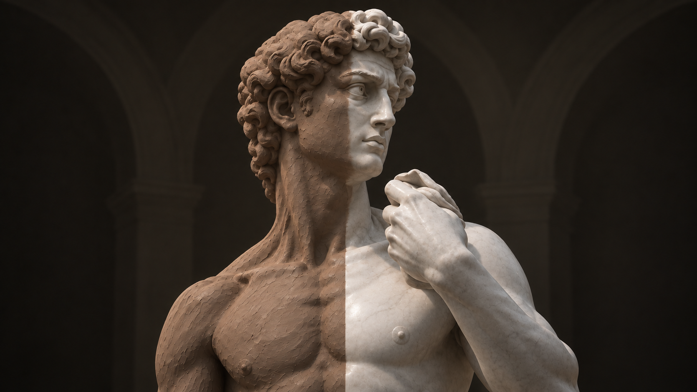

# Reference Viewer 3D

<p align="center">
  
</p>

A small, fast 3D reference viewer for clay sculpting. Load an OBJ, STL or
glTF, drop a matcap on it, orbit around it, and take the measurements you need
— with the numbers saved by name in the side panel and drawn on the model.

Built with PySide6 and OpenGL 3.3.

---

## Features

**Viewing**

- Loads OBJ, STL (binary or ASCII) and glTF/GLB files, centring the model on
  the origin automatically. glTF is the one common format that declares its
  unit — metres — and the measurement panel adopts it; OBJ and STL declare
  nothing, so nothing is guessed.
- Matcap shading with adjustable rotation, contrast, gamma, brightness,
  saturation, tint and vertical flip.
- Analytic shading modes: Lambert, Phong, Blinn-Phong, Cook-Torrance PBR and a
  normals view — each with key/fill/ambient lights and a full surface material
  (diffuse, specular colour and level, shininess, metalness, roughness,
  reflection colour).
- Flat (faceted) shading and a wireframe overlay for reading topology.
- A **Ghost** mode with a solidity slider, which draws the model see-through so
  you can read what is inside it: the far side of a form, the cut of a
  cross-section, or the armature standing in it.  Every surface along the view
  is summed rather than sorted, so a limb crossing a torso reads the same from
  any angle instead of coming apart where the form folds over itself.
- A **Planes** filter that breaks the surface into the flat planes a
  sculptor blocks a form in with, from a six-sided box down to a barely
  faceted surface -- on a fixed grid, or fitted to the model itself by any of
  three clusterings of its own surface. It can round the shading normals onto
  those planes, in which case it works under whichever shading mode you are
  in, or cut the form itself into them -- additive like clay or subtractive
  like stone -- in which case the silhouette, the wireframe and the shadow all
  come out faceted too. Either way the model itself is left alone.
- **Record the making of a form and scrub through it**, rather than only
  arriving at the end of it. Every stage is the form exactly as the Detail
  slider set that far would build it, so what you scrub past is what you could
  stop at. The recording runs in the background and the stages become
  scrubbable as they land, coarsest first.
- **Export that making as a video** — MP4, AVI, GIF or WebP — with each stage
  held on screen for as long as you say, the frame size, shading and ghosting
  chosen for the clip rather than inherited from the window, and each helper
  ticked in or out of shot. Which stage a frame is can be burned into its
  corner. GIF needs nothing installed; the other three use ffmpeg if it is
  there and say so plainly if it is not.
- Adjustable background gradient.
- The screen stays awake while the window is in front, so a pose holds
  while your hands are in the clay.

**Navigation**

| Gesture | Action |
| --- | --- |
| Left drag | Orbit around the point under the cursor, on the camera-facing plane through the object centre |
| Right or middle drag | Pan |
| Wheel | Zoom towards whatever the cursor is over |
| Alt + left drag | Orbit even while a tool is armed |
| Shift + left drag | Orbit in whole steps of the snap angle (15° by default) |
| `F` | Frame the object |
| `P` | Toggle perspective / orthographic |
| `1` … `6` | Front, back, left, right, top, bottom |

**Camera**

- Field of view from 5° to 120°, and a true orthographic projection. The
  orthographic extent is derived from the FOV and distance, so switching
  projection keeps the object the same size on screen.
- Save any camera pose under a name, rename it in place (`F2` or a double
  click), overwrite it, and cycle through the list with `[` and `]` or recall
  directly with `Ctrl+1` … `Ctrl+9`.

**Orientation**

Formats disagree about which axis points up — CAD and Blender exports are
usually Z-up, most sculpting tools are Y-up, and STL declares nothing — so a
file can arrive lying on its side. The Model tab turns it upright: pick the up
axis the file used, flip it if it came in upside down, and spin it a quarter
turn to face forwards. Measurements and annotations turn with the model, and
going back to the previous setting puts everything exactly where it was.

**Armature**

A wire under the form, laid out before any clay goes on: a graph of named nodes
joined by bones. It is not a rig — nothing is animated by it, nothing is skinned
or weighted. It is there to be read off the screen while you bend real wire to
length, and to tell the clay mode where the masses of a figure belong.

- Press `R` and click to place nodes along a limb, each joined to the last.
  Drag one to move it, `Shift`+drag to change how thick the form is there.
  Nodes can be dissolved out of the middle of a chain without breaking it and
  locked once they are right. Each of those is one undo step.
- Clicking a node selects it and highlights its row, whether or not the tool is
  armed — reading which node is which should not first require arming anything.
  With the tool armed, clicking a *second* node runs a bone between them;
  `Ctrl`+click (`Cmd` on macOS) does the same at any time, in the viewport or
  in the list, which is how you close a shoulder or a pelvic bar.
- Clicking a bone drops a node into the middle of it and splits it in two, so a
  chain can be subdivided where it needs more articulation rather than only
  extended from its end. The new node takes its thickness from the two it was
  dropped between.
- Double-click a row to rename a node or the armature itself.
- Every node carries its thickness as a radius in scene units rather than as a
  dot on the screen, so the ring grows as you zoom in and reads as the body
  rather than as a handle.
- The armature lives inside the model, so it is drawn over the form rather than
  hidden by it, and the part standing behind the surface is dimmed instead of
  cut away.

Or let a **guided preset** work the figure out for you. It walks a list of
anatomical landmarks — the C7 bump, the jugular notch, the two hip points, the
epicondyles either side of a knee — and never asks for a joint centre, because
nobody can point at the middle of a femoral head. The hip is placed a quarter
of the way from the trochanter you *can* feel towards the centre of the pelvis,
which carries it medial and a little up and back, where it really is. Asking
for what is visible and inferring the rest is both less to point at and more
accurate than asking for the guess directly.

Every rule is a ratio of the figure's own measured spans, so one preset fits a
child and a heroic nude and nothing drifts when the pose changes. The paired
landmarks then pay twice: the two epicondyles that locate an elbow are also the
width of the elbow, so every joint arrives already sized and you are never
asked for a thickness at all.

Place the midline and one side and the other is reflected across a plane fitted
through the midline landmarks — nineteen placements instead of thirty-three. A
mirrored point is drawn hollow, so a guess reads as a guess; correct one and it
is yours, because the mirror never writes over a point you have taken hold of.

The landmarks are kept afterwards rather than consumed, so nudging one
re-derives the nodes that read it: a misplaced hip point is a correction, not a
restart. A locked node keeps its place and its size through that — one padlock,
one meaning — and moving any node by hand hands the armature over to you and
stops the re-derivation, in the same undo step, so one `Ctrl+Z` puts it back
under the preset.

Every placed landmark is listed in the panel, in the preset's own order down
the figure, with its position in `X`, `Y` and `Z` in whatever unit the Measure
panel is set to. Select a row to ring that cross in the view; type or nudge a
number and the joints reading it follow at once, one undo step per number. Or
drag the cross itself, the way you would a node: the figure re-forms under the
cursor and the whole drag is one step. A cross answers within a tighter reach
than a node handle, so where the two sit together — which is half the joints of
a preset — aiming at the cross picks the landmark and a few pixels out picks the
node.
Deleting a landmark takes any guess mirrored from it along with it. An armature
you have taken over by hand keeps the nodes you made — its landmarks stay an
editable record of where the anatomy is, and **Rebuild Nodes** is how you hand
it back to the preset, keeping your names and whatever you locked.

**Cross-section**

- Cut the scene with a plane: X, Y, Z, or any direction — *Set Plane From View*
  squares the cut up with whatever you are looking at. `Ctrl+K` toggles it.
- Keep the material below the plane, above it, or a slice of a thickness you
  set, which is the view that shows how a form is built at that level.
- The profile at the cut is traced as a bright contour, and the exposed
  interior is flooded flat so the cut reads as solid material rather than as a
  hollow shell.

**Planes**

Drawing and sculpting both start by reducing a form to flat planes: the front
of the forehead, the side of the nose, the top of the cheekbone. The Planes
tab does that to the model.

*Simplify* chooses what the planes are used for, and the two settings are
mutually exclusive because the second contains the first.

**Simplify Normals** leaves the geometry alone. Every shading normal is
snapped to the nearest of a small set of directions, so the surface reads as a
handful of flats with hard edges between them, and the light on each flat is
even -- which is exactly what makes the turn of a form easy to see and to
copy. The silhouette stays as round as the model is.

*Planes from* chooses where that set of directions comes from.

**Grid** uses the same directions for every model: a cube, bevelled as far as
you ask. It is how a sculptor blocks a form in before they have looked at it,
and it is the mode to reach for when you want the planes measured against the
world rather than against the model.

The *Detail* slider sets how much of a turn one plane covers: 90 degrees at
the coarse end, which is exactly the six planes of a blocked-in box, down to
8 degrees, by which point only the sheen still facets. The slider is linear in
that angle, so a step at the coarse end changes the form by as much as a step
at the fine end -- move it slowly and the box grows bevels off its corners
first, and only then do the planes themselves subdivide. Every setting keeps a
plane square on each axis, so the front, side and top planes stay where an
artist expects them.

**PCA** reads the directions off the model instead. Every vertex normal is a
point on the sphere, weighted by how much surface it stands for, and that
cloud is split along its principal axes: the direction of greatest spread in a
group of normals is its first principal component, and the group is cut in
half across it. The group with the most spread left in it is always cut next,
so the first directions to appear are the big planes of the form and the later
ones refine them. The planes are the model's own -- the flat of a cheek, the
underside of a brow -- rather than a box the model happens to sit inside.

Here the *Detail* slider is a count of planes rather than an angle, climbing
from 2 to 256. It climbs by proportion rather than by a fixed step: going from
four planes to five redraws a form and going from two hundred to two hundred
and one is invisible, so each step of the slider is worth a roughly constant
*share* more planes. That leaves real control at the coarse end, where the
blocking-in happens, while the fine end still reaches into the hundreds.
Adding a plane splits a single one in two and leaves the rest alone, which
means the slider refines the break rather than rebuilding it each step. The fit runs
once, the first time the mode is turned on, off a thinned but fixed sample of
the normals -- so it costs nothing to load a model you never look at this way,
and a model always breaks the same way twice. A cube gives back its six faces
exactly.

**Regions** reads where the surface is as well as which way it faces, which
is what lets it tell two parts of a form apart when they happen to face the
same way -- the plane of a cheek and the plane of a temple stay two planes
with a seam between them, where PCA has only one direction to offer for both.
Each vertex becomes a row of a design matrix holding its normal, its position,
and how far out its own tangent plane lies; the surface is cut into a few
hundred small patches and then merged back together, at every step joining the
two patches that cost the least, which is Ward's criterion. Because the merge
is a hierarchy, the *Detail* slider is a cut of one tree: adding a plane
splits one and leaves the rest, exactly as in PCA mode. This is the one to
try first.

**Flats** asks a blunter question of the whole model at once: which single
plane does the most surface agree on? It takes that one, removes its surface,
and asks again -- so the largest flat of the form arrives first and the rest
in the order a sculptor would block them in. Nothing is averaged, so a stray
patch or a noisy scan cannot pull a plane off the flat it belongs to. The
price is that it does not nest: each step of the slider re-asks the question
rather than subdividing the last answer, so the planes shift about as you
drag. Reach for it when a form has real flats in it and you want those rather
than an even share-out of the surface.

Both of these weigh a vertex by the area it stands for *and* by how flat its
neighbourhood is, so the flats of the form decide where a plane sits and the
rounded turns between them follow along.

*Design matrix* — folded away under the boundary controls, because the
defaults are chosen to read a figure and most work never needs to open it —
is where those weights can be argued with. *Position* is what a whole radius
of travel across the form counts for against a right angle of turn in the
surface: at zero the fit reads facings only, like PCA, and two parts of the
form that face the same way come back as one plane; raise it and the form is
broken up as well as broken down, until at the top the planes are patches of
surface that happen to face somewhere. *Coplanarity* is what the gap between
two parallel planes counts for, which is what keeps two patches lying in one
plane together however far apart they sit. *Flat within* is how far a
vertex's neighbours may turn away from it before it stops counting as part of
a flat: narrow it and only the flattest surface decides where the planes go,
widen it and the turns get their say back. Each of these refits the model, so
they take effect when you let go of the slider rather than as you drag, and
*Reset to defaults* puts all three back. Each plane's direction is settled by
an M-estimate rather than an average -- the members that disagree most with
the first guess are down-weighted and the guess is taken again -- so a handful
of bad normals inside a patch cannot tilt it. Like PCA, they fit once, the
first time you pick the mode, and a model always breaks the same way twice.

**Simplify Geometry** rebuilds the form out of those planes instead of
rounding the light off them, so it really is faceted: straight runs of
silhouette, hard edges where the planes meet, a wireframe that follows the
flats, and a shadow to match. The planes come from the same fit the shading
setting uses and the *Design matrix* below weighs it for both, but only their
*facings* are taken -- where each flat actually goes is decided by the
material it stands for, not by the fit.

None of this is done by moving the model's vertices, because that cannot be
made to work: a patch of surface wraps and a plane does not, so flattening a
shoulder onto the shoulder's plane folds the far side of it back through the
near side. Instead the model is read into a lattice as a solid, worked as a
volume, and its surface found again from scratch. A plane arrives as a cut,
which is what a plane is to a sculptor.

*Method* is the choice between the two ways of making a form, and they do not
give the same one.

**Subtractive** is stone. The form starts as the block it would be carved out
of -- the convex hull of the whole model -- and every step of *Detail* is
another cut. The cut is taken through whichever part of the block is holding
the most air, and each half is then hulled again, so the hollows open up
deepest first: the gap between an arm and the ribs, then the knees, then the
face. The result always holds the whole model inside it, so it is a rough-out
with all the reach still present, waiting for the next cut to bring it down.

Detail buys two things at once here, and they are not equally worth having: a
cut opens one hollow, while another direction to cut along shaves every block
of the form at the same time. Doubling the directions brings the stone in
about twice as far as tripling the cuts does, so most of the slider goes
there. At the far end a figure comes back within a twelfth of its own volume
-- a carving rather than a rough-out, and still every bit of it a flat.

**Additive** is clay, and it is built rather than cut. The largest rectangular
block that will fit inside the model without poking out of it anywhere is
pressed into the form; then another into whatever is still bare, and another.
On a figure those land in the ribcage, the pelvis and the thighs, in that
order, because the order is simply where the most uncovered material is.
*Masses* is how many of them there are, and it is a control rather than a
measurement: how many masses a form has is a reading, and a torso is one mass
or two depending on who is looking. The range runs from a single lump in the
largest form up to every mass a standing figure has -- head, neck, ribcage,
pelvis, and upper arm, forearm, hand, thigh, shin and foot twice over -- and
the blocks stay clean the whole way, because a mass is a plain box set square
to the form it sits in and boxes stacked along a limb agree with each other.
Detail is laid on top of the masses rather than sharing a budget with them, so
reading a figure as more masses never costs it any modelling.

After the masses come the tubes. Every step of *Detail* lays another lump into
whichever part of the model the clay has not covered yet, largest first, so
the arms arrive before the hands and the hands before the fingers. A tube is
grown exactly as a mass is, but it is allowed the form's own planes as well as
the three axes of the mass it sits in, so it comes out bevelled where the
model turns. Nothing is ever told what a limb is.

Where two lumps cross they leave a notch, and a form full of notches reads as
a heap of stones rather than as one body. So the seams are filled, and in two
stages, because they come in two sizes.

The large ones are filled with more clay. Every pair of lumps that lie near
enough to be joined gets a further piece pushed across the seam between them,
shaped as the hull of what of each lump lies within a collar of the other --
which is the shape of a thumb-full of clay worked into a join. That hull is
then pulled back until it fits inside the model, exactly the way a lump is
grown out to it, so a join is made of flats like everything else and cannot
reach through the surface. A join that has to be pulled in further than the
lumps are thick is dropped: the two lie on opposite sides of a gap in the form
rather than across a seam, and a piece spanning them would be bridging air.
The collar is what keeps this honest. The hull of two *whole* lumps, on a form
anywhere near convex, is most of the form -- allow it and the mode quietly
stops being clay pressed into a shape and becomes a cast taken from one.

The small ones are closed in the volume, by a median filter run over the field
before the surface is read back out of it. A median is the right filter for
this and a blur is not: over a neighbourhood laid symmetrically about a point,
the median of a field that is planar there is that point's own value exactly,
so a flat passes through untouched however many passes are run. What it does
change is everything a flat is not -- a slot one cell wide is outvoted by the
material either side of it, a spike is outvoted by the air around it, and a
pinhole closes. Those are precisely the things a lattice cannot make a clean
surface out of, and one pass removes all of them: an additive form comes back
with no open edges at all, and a quarter as many places where the surface
passes through itself.

Both ends of that filter are yours, under *Finishing*. *Median* is how many
passes are run and *Median size* is how far each one reaches, in cells -- one
being the three-by-three-by-three block of corners around each corner. The
size is not a strength knob so much as which slots are within reach at all: a
pass reaching one cell has a cell of material either side of a one-cell slot
and closes it, and sees as much slot as material in a two-cell one and leaves
it exactly where it was. What keeps both ranges short is that a median cuts
both ways. A slot closes because it has material either side of it; by the
same arithmetic a corner is shaved because it has air on more sides than
material. One pass at one cell takes the slots out and leaves the form its
size; four passes at three cells take three fifths of the form away with
them.

*Relax* is the pass a sculptor makes last, going over the block-in with the
flat of a tool: the planes still read, but the form is no longer quarried out
of them. It works on the finished mesh rather than on the volume, because by
that point the volume has said everything it has to say. Each pass draws every
point towards the middle of its neighbours and then pushes it back out by a
shade more, which takes the corners off without letting the form shrink away,
and anything that ends up outside the model is put back onto it -- so relaxing
can never undo the containment the rest of the mode is careful about. At zero
you get the block-in exactly as it was cut. It does nothing in subtractive,
which is meant to keep its corners.

Past a point the slider stops adding lumps and starts bevelling the ones there
are, which is deliberate. A form built of sixty lumps reads as masses with
clean flats between them; the same form built of two hundred reads as rubble,
because every pair of lumps that cross at an angle leaves a ridge and enough
ridges are all you can see. Joining the lumps is what closes the gaps -- more
lumps is not, since a smaller lump in a gap leaves two narrower gaps.

**AutoSmooth** shades the result, in either mode, and does the same job as the
control of that name in 3ds Max. A facet that comes out of a lattice is only
roughly one plane: its triangles each lean by a fraction of a degree, and
shading every one of them on its own turns a clean flat into a mosaic. The
slider is the angle at which a turn stops being noise and starts being an
edge -- neighbouring triangles that agree to within it are gathered into a
group and share their normals, and anything sharper is left as the hard edge
it is. Thirty degrees is the usual reading and the default: every real plane
change on a blocked-in form is a far sharper turn than that. Nothing moves;
it is a change of shading and not of shape, and because it re-reads the
normals of a form that has already been built it costs a tenth of a second
rather than a rebuild. At zero every triangle is shaded on its own again.

**Detail and Masses have soft ends.** Both sliders stop where their useful
range stops, and both will take a number typed into the box past that: the
slider then grows to reach it, and can be dragged over the wider range from
then on.

For *Masses* that is room for a form that is not a figure. Sixty-four is past
every mass anyone reads a standing figure as, and going much beyond it the
block-in stops reading as masses and starts reading as rubble -- measured on a
figure, the surface holds a third fewer of its area in its commonest facings
at two hundred and fifty-six masses than at thirty-two, which is what rubble
looks like as a number. It is offered because it is yours to say.

For *Detail* it buys something different from what the slider itself buys. At
the slider's own end the form already has every plane a fit will give it and
every block or lump those planes buy, and going past that changes nothing:
doubling the planes to five hundred moved a carving by a hundredth of its
volume and left the clay exactly where it was. What is holding it there is the
lattice the form is worked on, so that is what a typed value lifts -- the same
reading of the form, resolved finer. It shows as crisper flats and straighter
creases rather than as more of them, and it costs, because a lattice is
three-dimensional: at the top of the range a figure comes back with three
times the triangles and takes about eight seconds to rebuild instead of three.
Two hundred is where the lattice meets its own memory ceiling and stops
getting finer, which is why that is the end of it.

Read either against the model's own silhouette and it says how much of the
form is mass and how much is detail.

What comes back either way is a union of convex solids, each one the meeting
of a handful of half-spaces, and the surface is read off the lattice by dual
contouring: one vertex per cell, placed where the planes crossing that cell
agree. Those planes are exact, so a cell inside a flat lands dead on it, a
cell along a crease lands on the line where two flats cross, and a cell at a
corner lands where three do. The flats come out flat to the last digit, the
creases straight, and the surface closed and free of folds, because an
isosurface always is. That is also why the clay is joined as a volume and
never as surfaces: a tube laid across a mass leaves no seam where they meet
and no sliver where they cross, because there is nothing there to stitch. The
model itself is then held against the result as a floor under the stone and a
ceiling over the clay, so that one is larger than the model and the other
smaller by construction rather than by luck.

*Detail* is a count of planes, coarse to fine, and with it a count of solids.
Rebuilding geometry is real work, so it takes effect on letting go of the
slider rather than at every value a drag passes over, though the line under
the slider follows the handle so the drag is not blind. The fit is kept apart
from the rebuild and only run again when the model or the design matrix
changes, which makes flipping between additive and subtractive, or working the
masses, free.

**The model is never modified.** What the viewer draws is a stand-in, and
picking, measuring, painting and the section cut all still read the real
surface underneath. Unlike the shading filter, the stand-in is a mesh of its
own -- its own vertices and its own triangles, a good deal fewer of both,
found from the volume rather than moved from the model's. Marks already made
on the model stay where they were made, so they will sit off the flats by
however far the flats moved.

*Draw the plane boundaries* lines every seam between two planes, in a colour
and width you set, the way a construction drawing marks where the form turns.
The lines are worked out from the quantisation itself rather than found by
comparing pixels -- from the grid in Grid mode, and in the fitted modes from
where the two nearest planes are equally near -- so they hold the width you
asked for at any zoom. Where two planes meet without the form turning at all,
which is what happens when a fit that reads position divides a broad flat, no
line is drawn: the shading runs straight through, so a line there would say
the form turns where it does not. They
fade out where the planes themselves shrink to a pixel or two -- around the
silhouette, or at the fine end of the slider -- instead of flooding the
surface. They belong to *Simplify Normals*: once the geometry has been cut,
the seams are real edges of the model, and the wireframe or faceted shading
already shows them.

The planes are worked out on the model rather than on the screen, so they stay
put on the form as you orbit around it. And because rounding the normals
changes them and not the shading, that setting applies to a matcap, to any of
the analytic modes and to the normals view alike. Flat (faceted) shading,
which quantises per triangle instead of per direction, sits on the same tab,
and is worth turning on under *Simplify Geometry* to see the flats with no
softening across their edges at all.

**High Quality**

A shading mode that adds soft shadows from the key light and screen-space
ambient occlusion to the usual clay shading, with strength, softness, bias,
radius and intensity all adjustable. Neither traces a ray: a shadow map, a
depth and normal pre-pass and one occlusion pass cost a few milliseconds
between them, so the view stays live while you orbit it. Turn off *Light
follows camera* for a shadow that stays put as the model turns.

**Pedestal**

Stand the model on a disc, either at its lowest vertex or at a level you
choose, with adjustable diameter, thickness and colour. It is ordinary
geometry, so it catches the cast shadow — which is what makes contact and
height readable.

**Measuring**

- Press `M`, then click two points on the surface. Dragging still orbits, so
  the left button serves both gestures.
- Optional snapping to the nearest vertex, or free placement anywhere in space
  for spans that do not start on the model.
- Every measurement is listed by name in the panel, is renameable, can be
  hidden individually, and stays drawn in the scene as a thick labelled line.
- Measurements start locked. Click the padlock on a row to unlock one, and its
  endpoints turn into square handles you can drag in the view — on the surface,
  or anywhere in space with free placement on.
- Set a unit label and a scale factor once per model — an OBJ carries no units,
  so the viewer does not guess.

**Annotating**

- Press `A`, then draw straight onto the surface: freehand, straight lines or
  circles, in any colour and width. Useful for blocking in muscle masses, bony
  landmarks and plane breaks.
- Strokes are real geometry lifted a hair off the mesh, so the model hides the
  ones painted on its far side instead of letting them bleed through.
- The eraser (`E`) rubs out the parts of a stroke under the brush and splits
  what is left, rather than deleting whole strokes.
- A stroke that runs off the silhouette breaks there instead of bridging the
  gap, so paint never floats in front of the background.

**Undo**

`Ctrl+Z` / `Ctrl+Shift+Z` cover measurements, annotations and saved views. Each
edit is a command that knows how to reverse itself, and an interactive gesture
— a dragged endpoint, a swipe of the eraser — records as a single step.

Camera motion is deliberately not recorded: orbiting is a gesture rather than
an edit, and burying real changes under a hundred camera steps is what makes
undo useless in a 3D viewer.

**Sessions**

Camera, shading, matcap choice, measurements, annotations and saved views are
written to a JSON file. Saving with `Ctrl+S` writes `<model>.refview.json` next
to the model, and that sidecar is picked up automatically the next time the
model is opened. Files written by an older build still load. OBJ, session and
image files can also be dropped onto the window.

---

## Install

```bash
conda env create -f environment.yml
```

```bash
conda activate refview
```

Then run it:

```bash
python run.py
```

Or install the package and use the console script:

```bash
pip install -e .
```

```bash
refview resources/models/Pose_02.obj --matcap resources/matcaps/clay_terracotta.png
```

`refview --help` lists the startup options (`model`, `--matcap`, `--session`).

### Desktop releases

Push a tag such as `v1.1.0` to build self-contained archives for Windows,
Intel macOS and Apple Silicon macOS. The GitHub Actions release workflow
publishes the three archives to a GitHub release automatically.

### Requirements

- Python 3.10+, a GPU with OpenGL 3.3 core profile.
- PySide6 is pinned below 6.8: newer Qt builds need a more recent MSVC runtime
  than many Windows machines have installed, and fail with
  `DLL load failed while importing QtCore`.
- `numpy`, `PySide6` and `PyOpenGL` are installed with pip rather than conda so
  each brings its own runtime libraries; mixing conda-forge numpy with pip Qt
  wheels can produce a broken BLAS on Windows.

---

## Resources

```
resources/
  matcaps/   any PNG/JPG dropped here appears in the Matcap gallery
  models/    the default folder the file dialog opens in
```

Regenerate the bundled matcap set (analytic sphere renders, no downloads):

```bash
python tools/generate_matcaps.py
```

Point `REFVIEW_RESOURCES` at another directory to use your own library.

---

## Layout

```
src/refview/
  core/      pure Python, no Qt: mesh, the OBJ/STL/glTF loaders, the picking
             index, camera, raycasting, cross-sections, the pedestal,
             measurements, annotations, the armature and its landmark
             presets, bookmarks, undo commands, settings, session
             persistence
  render/    OpenGL: shader programs, matcap textures, offscreen targets, the
             scene and stroke renderers
  ui/        Qt: viewport widget, navigation, the measuring, annotating and
             armature tools, the 2D overlay, the observable document, panels
             and the main window
tools/       the matcap generator
tests/       pytest suite for the core layer
```

Three rules keep the pieces apart:

- **`core` never imports Qt.** All of the geometry and document logic is
  testable without a display, which is what the test suite exercises.
- **`render` owns every GL call.** The viewport widget hands it a camera and a
  settings object and gets a drawn frame back. It also restores a neutral GL
  state afterwards, because the 2D overlay is painted with `QPainter` on the
  same context.
- **Panels edit dataclasses, never widgets belonging to someone else.** They
  mutate the settings held by `ViewerState` and emit a change signal; the
  viewport listens and repaints.
- **Every document edit is a command.** Four generic commands — set attributes,
  add, remove, replace — cover measurements, annotations, armatures and
  bookmarks alike, so undo needs no new code when a new kind of object turns
  up. The armature was added without a fifth.

Measurements are drawn in screen space with `QPainter` rather than as 3D
geometry. That gives reliable line thickness and antialiasing on every driver,
keeps them legible in front of the model, and makes the text labels free.

The armature is drawn in screen space for the opposite reason: it lives inside
the form, so geometry the model could hide would be a wire nobody ever saw. The
part behind the surface is dimmed instead, which takes one ray per node — cheap
for a figure, and cached against the camera so an orbit does not pay for it
every frame.

Annotations go the other way and are drawn as geometry, because paint on the
back of the model has to be hidden by it. Each segment becomes a quad that the
vertex shader widens in screen space, which keeps the brush a constant number
of pixels wide at any zoom — something `glLineWidth` cannot promise on a core
profile. The section contour is expanded through the same shader.

Every click, hover and painted sample casts a ray, so picking speed is what
decides whether a large scan still feels direct. Triangles are sorted along a
Morton curve into leaf boxes; a ray tests every box in one vectorised sweep and
then intersects only the triangles in the leaves it entered. On a
half-million-triangle mesh that is about 0.5 ms per ray against 90 ms for the
brute-force pass it replaced.

## Tests

```bash
pytest
```

## Changelog

Release notes live in [CHANGELOG.md](CHANGELOG.md).
