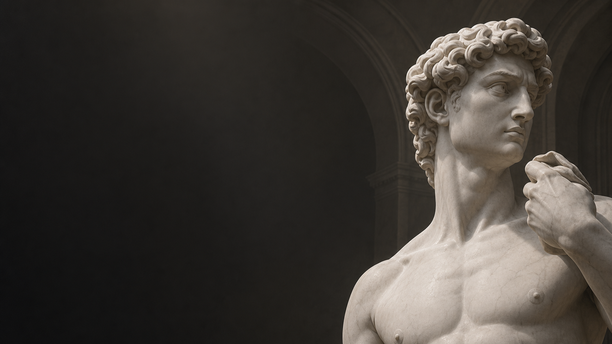

# Reference Viewer 3D

<p align="center">
  
</p>

A small, fast 3D reference viewer for clay sculpting. Load an OBJ, STL or
glTF, drop a matcap on it, orbit around it, and take the measurements you need
— with the numbers saved by name in the side panel and drawn on the model.

Built with PySide6 and OpenGL 3.3.

---

## Features

**Viewing**

- Loads OBJ, STL (binary or ASCII) and glTF/GLB files, centring the model on
  the origin automatically. glTF is the one common format that declares its
  unit — metres — and the measurement panel adopts it; OBJ and STL declare
  nothing, so nothing is guessed.
- Matcap shading with adjustable rotation, contrast, gamma, brightness,
  saturation, tint and vertical flip.
- Analytic shading modes: Lambert, Phong, Blinn-Phong, Cook-Torrance PBR and a
  normals view — each with key/fill/ambient lights and a full surface material
  (diffuse, specular colour and level, shininess, metalness, roughness,
  reflection colour).
- Flat (faceted) shading and a wireframe overlay for reading topology.
- A **Planes** filter that breaks the surface into the flat planes a
  sculptor blocks a form in with, from a six-sided box down to a barely
  faceted surface -- either on a fixed grid or on directions read out of the
  model's own normals by PCA. It acts on the normals rather than on the
  shading, so it works under whichever shading mode you are in.
- Adjustable background gradient.
- The screen stays awake while the window is in front, so a pose holds
  while your hands are in the clay.

**Navigation**

| Gesture | Action |
| --- | --- |
| Left drag | Orbit around the point under the cursor, on the camera-facing plane through the object centre |
| Right or middle drag | Pan |
| Wheel | Zoom towards whatever the cursor is over |
| Alt + left drag | Orbit even while a tool is armed |
| Shift + left drag | Orbit in whole steps of the snap angle (15° by default) |
| `F` | Frame the object |
| `P` | Toggle perspective / orthographic |
| `1` … `6` | Front, back, left, right, top, bottom |

**Camera**

- Field of view from 5° to 120°, and a true orthographic projection. The
  orthographic extent is derived from the FOV and distance, so switching
  projection keeps the object the same size on screen.
- Save any camera pose under a name, rename it in place (`F2` or a double
  click), overwrite it, and cycle through the list with `[` and `]` or recall
  directly with `Ctrl+1` … `Ctrl+9`.

**Orientation**

Formats disagree about which axis points up — CAD and Blender exports are
usually Z-up, most sculpting tools are Y-up, and STL declares nothing — so a
file can arrive lying on its side. The Model tab turns it upright: pick the up
axis the file used, flip it if it came in upside down, and spin it a quarter
turn to face forwards. Measurements and annotations turn with the model, and
going back to the previous setting puts everything exactly where it was.

**Cross-section**

- Cut the scene with a plane: X, Y, Z, or any direction — *Set Plane From View*
  squares the cut up with whatever you are looking at. `Ctrl+K` toggles it.
- Keep the material below the plane, above it, or a slice of a thickness you
  set, which is the view that shows how a form is built at that level.
- The profile at the cut is traced as a bright contour, and the exposed
  interior is flooded flat so the cut reads as solid material rather than as a
  hollow shell.

**Planes**

Drawing and sculpting both start by reducing a form to flat planes: the front
of the forehead, the side of the nose, the top of the cheekbone. The Planes
tab does that to the model. Every shading normal is snapped to the nearest of
a small set of directions, so the surface reads as a handful of flats with
hard edges between them, and the light on each flat is even -- which is
exactly what makes the turn of a form easy to see and to copy.

*Planes from* chooses where that set of directions comes from.

**Grid** uses the same directions for every model: a cube, bevelled as far as
you ask. It is how a sculptor blocks a form in before they have looked at it,
and it is the mode to reach for when you want the planes measured against the
world rather than against the model.

The *Detail* slider sets how much of a turn one plane covers: 90 degrees at
the coarse end, which is exactly the six planes of a blocked-in box, down to
8 degrees, by which point only the sheen still facets. The slider is linear in
that angle, so a step at the coarse end changes the form by as much as a step
at the fine end -- move it slowly and the box grows bevels off its corners
first, and only then do the planes themselves subdivide. Every setting keeps a
plane square on each axis, so the front, side and top planes stay where an
artist expects them.

**PCA** reads the directions off the model instead. Every vertex normal is a
point on the sphere, weighted by how much surface it stands for, and that
cloud is split along its principal axes: the direction of greatest spread in a
group of normals is its first principal component, and the group is cut in
half across it. The group with the most spread left in it is always cut next,
so the first directions to appear are the big planes of the form and the later
ones refine them. The planes are the model's own -- the flat of a cheek, the
underside of a brow -- rather than a box the model happens to sit inside.

Here the *Detail* slider is the fraction of those principal directions to
keep, from 2 up to 64, so the number it names is the number of planes. Adding
one splits a single plane in two and leaves the rest alone, which means the
slider refines the break rather than rebuilding it each step. The fit runs
once, the first time the mode is turned on, off a thinned but fixed sample of
the normals -- so it costs nothing to load a model you never look at this way,
and a model always breaks the same way twice. A cube gives back its six faces
exactly.

*Draw the plane boundaries* lines every seam between two planes, in a colour
and width you set, the way a construction drawing marks where the form turns.
The lines are worked out from the quantisation itself rather than found by
comparing pixels -- from the grid in one mode, and in the other from where the
two nearest directions are equally near -- so they hold the width you asked
for at any zoom, and they
fade out where the planes themselves shrink to a pixel or two -- around the
silhouette, or at the fine end of the slider -- instead of flooding the
surface.

The planes are worked out on the model rather than on the screen, so they stay
put on the form as you orbit around it. And because the filter changes the
normals and not the shading, it applies to a matcap, to any of the analytic
modes and to the normals view alike. Flat (faceted) shading, which quantises
per triangle instead of per direction, sits on the same tab.

**High Quality**

A shading mode that adds soft shadows from the key light and screen-space
ambient occlusion to the usual clay shading, with strength, softness, bias,
radius and intensity all adjustable. Neither traces a ray: a shadow map, a
depth and normal pre-pass and one occlusion pass cost a few milliseconds
between them, so the view stays live while you orbit it. Turn off *Light
follows camera* for a shadow that stays put as the model turns.

**Pedestal**

Stand the model on a disc, either at its lowest vertex or at a level you
choose, with adjustable diameter, thickness and colour. It is ordinary
geometry, so it catches the cast shadow — which is what makes contact and
height readable.

**Measuring**

- Press `M`, then click two points on the surface. Dragging still orbits, so
  the left button serves both gestures.
- Optional snapping to the nearest vertex, or free placement anywhere in space
  for spans that do not start on the model.
- Every measurement is listed by name in the panel, is renameable, can be
  hidden individually, and stays drawn in the scene as a thick labelled line.
- Measurements start locked. Click the padlock on a row to unlock one, and its
  endpoints turn into square handles you can drag in the view — on the surface,
  or anywhere in space with free placement on.
- Set a unit label and a scale factor once per model — an OBJ carries no units,
  so the viewer does not guess.

**Annotating**

- Press `A`, then draw straight onto the surface: freehand, straight lines or
  circles, in any colour and width. Useful for blocking in muscle masses, bony
  landmarks and plane breaks.
- Strokes are real geometry lifted a hair off the mesh, so the model hides the
  ones painted on its far side instead of letting them bleed through.
- The eraser (`E`) rubs out the parts of a stroke under the brush and splits
  what is left, rather than deleting whole strokes.
- A stroke that runs off the silhouette breaks there instead of bridging the
  gap, so paint never floats in front of the background.

**Undo**

`Ctrl+Z` / `Ctrl+Shift+Z` cover measurements, annotations and saved views. Each
edit is a command that knows how to reverse itself, and an interactive gesture
— a dragged endpoint, a swipe of the eraser — records as a single step.

Camera motion is deliberately not recorded: orbiting is a gesture rather than
an edit, and burying real changes under a hundred camera steps is what makes
undo useless in a 3D viewer.

**Sessions**

Camera, shading, matcap choice, measurements, annotations and saved views are
written to a JSON file. Saving with `Ctrl+S` writes `<model>.refview.json` next
to the model, and that sidecar is picked up automatically the next time the
model is opened. Files written by an older build still load. OBJ, session and
image files can also be dropped onto the window.

---

## Install

```bash
conda env create -f environment.yml
```

```bash
conda activate refview
```

Then run it:

```bash
python run.py
```

Or install the package and use the console script:

```bash
pip install -e .
```

```bash
refview resources/models/Pose_02.obj --matcap resources/matcaps/clay_terracotta.png
```

`refview --help` lists the startup options (`model`, `--matcap`, `--session`).

### Desktop releases

Push a tag such as `v1.1.0` to build self-contained archives for Windows,
Intel macOS and Apple Silicon macOS. The GitHub Actions release workflow
publishes the three archives to a GitHub release automatically.

### Requirements

- Python 3.10+, a GPU with OpenGL 3.3 core profile.
- PySide6 is pinned below 6.8: newer Qt builds need a more recent MSVC runtime
  than many Windows machines have installed, and fail with
  `DLL load failed while importing QtCore`.
- `numpy`, `PySide6` and `PyOpenGL` are installed with pip rather than conda so
  each brings its own runtime libraries; mixing conda-forge numpy with pip Qt
  wheels can produce a broken BLAS on Windows.

---

## Resources

```
resources/
  matcaps/   any PNG/JPG dropped here appears in the Matcap gallery
  models/    the default folder the file dialog opens in
```

Regenerate the bundled matcap set (analytic sphere renders, no downloads):

```bash
python tools/generate_matcaps.py
```

Point `REFVIEW_RESOURCES` at another directory to use your own library.

---

## Layout

```
src/refview/
  core/      pure Python, no Qt: mesh, the OBJ/STL/glTF loaders, the picking
             index, camera, raycasting, cross-sections, the pedestal,
             measurements, annotations, bookmarks, undo commands, settings,
             session persistence
  render/    OpenGL: shader programs, matcap textures, offscreen targets, the
             scene and stroke renderers
  ui/        Qt: viewport widget, navigation, measuring and annotating tools,
             the 2D overlay, the observable document, panels and the main
             window
tools/       the matcap generator
tests/       pytest suite for the core layer
```

Three rules keep the pieces apart:

- **`core` never imports Qt.** All of the geometry and document logic is
  testable without a display, which is what the test suite exercises.
- **`render` owns every GL call.** The viewport widget hands it a camera and a
  settings object and gets a drawn frame back. It also restores a neutral GL
  state afterwards, because the 2D overlay is painted with `QPainter` on the
  same context.
- **Panels edit dataclasses, never widgets belonging to someone else.** They
  mutate the settings held by `ViewerState` and emit a change signal; the
  viewport listens and repaints.
- **Every document edit is a command.** Four generic commands — set attributes,
  add, remove, replace — cover measurements, annotations and bookmarks alike,
  so undo needs no new code when a new kind of object turns up.

Measurements are drawn in screen space with `QPainter` rather than as 3D
geometry. That gives reliable line thickness and antialiasing on every driver,
keeps them legible in front of the model, and makes the text labels free.

Annotations go the other way and are drawn as geometry, because paint on the
back of the model has to be hidden by it. Each segment becomes a quad that the
vertex shader widens in screen space, which keeps the brush a constant number
of pixels wide at any zoom — something `glLineWidth` cannot promise on a core
profile. The section contour is expanded through the same shader.

Every click, hover and painted sample casts a ray, so picking speed is what
decides whether a large scan still feels direct. Triangles are sorted along a
Morton curve into leaf boxes; a ray tests every box in one vectorised sweep and
then intersects only the triangles in the leaves it entered. On a
half-million-triangle mesh that is about 0.5 ms per ray against 90 ms for the
brute-force pass it replaced.

## Tests

```bash
pytest
```

## Changelog

Release notes live in [CHANGELOG.md](CHANGELOG.md).
